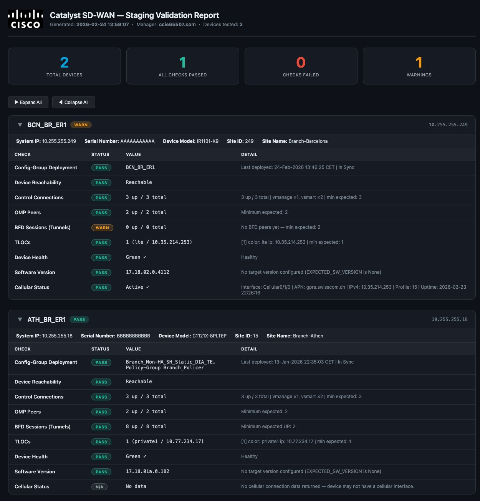

# Cisco Catalyst SD-WAN – ZTP Staging Validation Tool

Automated staging validation script for Cisco Catalyst SD-WAN routers
provisioned via Zero-Touch Provisioning (ZTP). Generates a self-contained
HTML report with per-device, per-check results and an interactive dashboard.

---

## What it validates

| # | Check | PASS condition | API source |
|---|-------|---------------|------------|
| 1 | **Config-Group Deployment** | `templateStatus == "success"` | `GET /dataservice/system/device/vedges` |
| 2 | **Device Reachability** | `reachability == "reachable"` | `GET /dataservice/device` |
| 3 | **Control Connections** | `up >= MIN_CONTROL_CONNECTIONS` | `GET /dataservice/device/control/synced/connections` |
| 3b | **OMP Peers** | `ompPeersUp >= MIN_OMP_PEERS` | `GET /dataservice/device/counters` |
| 4 | **BFD Sessions (Tunnels)** | `bfd-sessions-up >= MIN_BFD_SESSIONS_UP` | `GET /dataservice/device/bfd/summary` |
| 5 | **TLOCs** | `count >= MIN_TLOCS` and all expected colors present | `GET /dataservice/device/omp/tlocs/advertised` |
| 6 | **Device Health** | `state == "green"` | `GET /dataservice/device` |
| 7 | **Software Version** | matches `EXPECTED_SW_VERSION` (skipped if `None`) | `GET /dataservice/device` |
| 8 | **Cellular Status** *(optional)* | Active interface found | `GET /dataservice/device/cellular/connection` |

### Status logic per check

| Status | Meaning |
|--------|---------|
| **PASS** | Condition fully met |
| **WARN** | Partial result or below minimum (does not affect overall PASS/FAIL on its own unless it is the worst result) |
| **FAIL** | Critical condition not met |
| **N/A** | Check skipped (device unreachable with `ENFORCE_REACHABILITY=True`, or optional check disabled) |

**Config-Group Deployment** specific outcomes:

| `templateStatus` value | Result |
|-----------------------|--------|
| `"success"` | PASS |
| `""`, `"not applicable"`, `"none"` | WARN — device may be in CLI mode (never deployed) |
| Any other value (e.g. `"failure"`) | FAIL — deploy attempted but failed |

**BFD Sessions** never shows FAIL — a freshly staged device with a single transport and no remote WAN edge peers yet will legitimately have 0 sessions. All sub-minimum results show WARN.

**Overall device status** rolls up as: any FAIL → FAIL; no FAIL but any WARN → WARN; all PASS → PASS.

---

## Real-time vs. cached data

| Check | Data type | Notes |
|-------|-----------|-------|
| Control Connections | **Real-time** | Tunnelled live to device via Manager |
| OMP Peers | **Real-time** | Live counters from device process |
| BFD Sessions | **Real-time** | Live BFD process state |
| TLOCs | **Real-time** | Live OMP RIB query |
| Cellular Status | **Real-time** | Live cellular modem state |
| Device Reachability | Cached | Updated by Manager polling (~30–60 s lag) |
| Device Health / State | Cached | Same inventory record as reachability |
| Software Version | Cached | Static after onboarding |
| Config-Group Deployment | Cached | Updated after each push operation |
| Device Model | Cached | Static after onboarding |

---

## Requirements

```bash
pip install requests
```

Python 3.8+ is required.

---

## CSV Format

The CSV file must contain the following columns (header row required):

```csv
hostname,serial_number,system_ip
BR-ZURICH-01,XXXXXXXXXXXX,10.10.10.1
BR-BERN-01,XXXXXXXXXXXX,10.10.10.2
```

Column name aliases are supported (case-insensitive):

| Field | Accepted column names |
|-------|-----------------------|
| `hostname` | hostname, host_name, host-name, device |
| `serial_number` | serial_number, serial-number, serialnumber, serial, sn, board_serial |
| `system_ip` | system_ip, system-ip, ip_address, ip, mgmt_ip |

---

## Configuration

Open the script and adjust the variables at the top of the file:

```python
# ── SD-WAN Manager connection ──────────────────────────────────────────────
VMANAGE_HOST     = "192.168.1.1"     # SD-WAN Manager IP or FQDN
VMANAGE_PORT     = 443               # Port (443 or 8443)
VMANAGE_USERNAME = "admin"
VMANAGE_PASSWORD = "C1sco12345!"
DISABLE_SSL_VERIFY = True            # Set False in production with valid certs

# ── Minimum expected values ────────────────────────────────────────────────
MIN_CONTROL_CONNECTIONS = 2          # Minimum control plane connections (vManage + vSmarts)
MIN_BFD_SESSIONS_UP     = 1          # Minimum BFD sessions expected UP
MIN_OMP_PEERS           = 2          # Minimum OMP peers expected UP
MIN_TLOCS               = 1          # Minimum TLOCs advertised into OMP

ENFORCE_REACHABILITY    = True       # True  = skip all checks and mark FAIL if device is
                                     #         unreachable (recommended for staging)
                                     # False = run all checks regardless of reachability

EXPECTED_TLOC_COLORS    = None       # Optional: list of required TLOC colors to validate.
                                     # Examples:
                                     #   None               → skip color check
                                     #   ["lte"]            → single required color
                                     #   ["lte", "private1"]→ multiple required colors
                                     # If a required color is missing the check shows WARN.

EXPECTED_SW_VERSION     = None       # Optional: enforce a specific software version.
                                     # Example: "17.12.1a"
                                     # None = skip version check (always PASS)

CHECK_CELLULAR          = False      # True  = add Cellular Status check to the report.
                                     #         Checks for an active cellular interface and
                                     #         shows: interface, APN, IPv4, profile, uptime.
                                     # False = skip cellular check entirely.

# ── Output ─────────────────────────────────────────────────────────────────
OUTPUT_HTML = "sdwan_staging_report.html"
```

---

## Usage

### Basic

```bash
python3 sdwan_staging_validator.py --csv devices.csv
```

### Custom output filename

```bash
python3 sdwan_staging_validator.py --csv devices.csv --output staging_report_2026-02-24.html
```

### Debug field names (API diagnostics)

```bash
python3 sdwan_staging_validator.py --csv devices.csv --debug-fields
```

Dumps raw API field names and values for the first CSV device across all
relevant endpoints. Useful for diagnosing field name mismatches when
connecting to an unfamiliar Manager version.

---

## HTML Report Features

### Summary dashboard

Four clickable summary cards at the top of the report:

| Card | Action |
|------|--------|
| **Total Devices** | Show all devices |
| **All Checks Passed** | Filter to PASS devices only |
| **Checks Failed** | Filter to FAIL devices only |
| **Warnings** | Filter to WARN devices only |

Click a card to filter the device list. Click the same card again (or **Total Devices**) to reset. The active filter card is highlighted with a blue border.

### Device cards

Each device is displayed as a collapsible card. By default all cards are **collapsed**, showing only:
- Hostname + overall status badge
- System IP, Serial Number, Device Model, Site ID, Site Name

Click anywhere on the card header (or the ▶ chevron) to expand and reveal the check table. Use the **Expand All / Collapse All** buttons above the device list to toggle all cards at once.

### Check table

| Column | Width | Content |
|--------|-------|---------|
| Check | 200 px | Check name |
| Status | 90 px | PASS / WARN / FAIL / N/A pill |
| Value | 300 px | Measured value (e.g. `3 up / 3 total`) |
| Detail | remaining | Thresholds, peer breakdown, timestamps, etc. |

Column widths are fixed and identical across all device cards so the layout is consistent regardless of content length.

### Device metadata bar

Each card shows the following metadata between the header and the check table:

- **System IP**
- **Serial Number**
- **Device Model** — derived from `chasisNumber` in the vedge record (e.g. `IR1101-K9-XXXXXXXXXXXX` → `IR1101-K9`)
- **Site ID** — from inventory record
- **Site Name** — from inventory record

---

## Output

The script produces:
- **Console summary** — quick pass/warn/fail count per device
- **HTML report** (`sdwan_staging_report.html`) — fully self-contained single-file report (no external dependencies, Cisco logo embedded as base64)

---

## Exit codes

| Code | Meaning |
|------|---------|
| `0` | All devices passed (or warnings only) |
| `1` | One or more devices **failed** |

This makes the script safe to embed in CI/CD pipelines.

---

## Required Permissions

This script only performs **read-only API calls** — it never modifies any configuration, pushes templates, or changes device state. No write or admin privileges are required.

### Recommended: dedicated read-only user

It is strongly recommended to create a dedicated SD-WAN Manager user for this script rather than using an admin account. The minimum required role is **read-only** with the appropriate resource scope.

**Steps to create the user in SD-WAN Manager:**

1. Navigate to **Administration → Users** (or **Administration → Manage Users** depending on Manager version)
2. Create a new local user (e.g. `staging-validator`)
3. Assign the built-in **`read-only`** user role
4. Set the resource group / scope to cover the devices you want to validate (use the default group if all devices are in scope)
5. Set the credentials in the script:

```python
VMANAGE_USERNAME = "staging-validator"
VMANAGE_PASSWORD = "YourSecurePassword"
```

Using a dedicated read-only account limits the blast radius in case the credentials are ever exposed, and provides a clear audit trail in Manager logs.

---

## Authentication

The script uses **auto-detecting authentication** that selects the best available method for the connected Manager version — no configuration required.

### Priority 1 — JWT-based login (Manager ≥ 20.12)

```
POST /dataservice/client/login
Content-Type: application/json

{ "username": "admin", "password": "C1sco12345!" }
```

| Token | Response field | Applied as HTTP header |
|-------|---------------|------------------------|
| JWT access token | `token` | `Authorization: Bearer <token>` |
| CSRF token | `csrf` | `X-XSRF-TOKEN: <csrf>` |

Logout sends `POST /dataservice/client/logout` to invalidate the session server-side.

### Priority 2 — Session-based fallback (Manager ≤ 20.11)

Automatically activated when the JWT endpoint returns an HTML login page.

```
# Step 1 — obtain JSESSIONID cookie
POST /j_security_check
Content-Type: application/x-www-form-urlencoded

# Step 2 — obtain XSRF token
GET /dataservice/client/token
```

Logout sends `GET /logout`.

### Compatibility matrix

| Manager release | Auth method used |
|----------------|-----------------|
| 20.12 and later | JWT (Priority 1) |
| 20.11 and earlier | Session cookie (Priority 2, automatic fallback) |

---

## Troubleshooting

| Symptom | Likely cause |
|---------|-------------|
| `Authentication failed` | Wrong credentials or Manager IP/port |
| `Device X not found in inventory` | Device hasn't registered yet; ZTP may still be in progress |
| Config-Group shows **WARN / Not assigned** | Device is in CLI mode — no config-group or template has ever been pushed |
| Config-Group shows **FAIL** | A push was attempted but failed (check `configStatusMessage` in detail column) |
| Control Connections shows **FAIL** (0 up) | Device has no active DTLS sessions to controllers — check WAN transport |
| OMP Peers shows **FAIL** (0 up) | OMP sessions have not formed — control connections must be UP first |
| BFD Sessions shows **WARN** (0 up / 0 total) | No WAN edge peers reachable yet — expected on a freshly staged standalone device |
| TLOCs shows **FAIL** (0) | No TLOCs advertised into OMP — overlay cannot form |
| TLOCs shows **WARN** (missing colors) | Count meets minimum but a required color from `EXPECTED_TLOC_COLORS` is absent |
| Cellular Status shows **FAIL** | Cellular interfaces found but none is active — check SIM, APN, or signal |
| Cellular Status shows **N/A** | No cellular interface data returned — device may not have a cellular modem, or `CHECK_CELLULAR=False` |
| All checks show **N/A** after Reachability FAIL | `ENFORCE_REACHABILITY=True` (default) — set to `False` to run checks regardless |

---

## Example Validation Report

The screenshot below shows a real report output with two devices — one with a WARN status (BFD sessions not yet established) and one fully passing all checks, including Cellular Status showing N/A for a device without a cellular interface.


